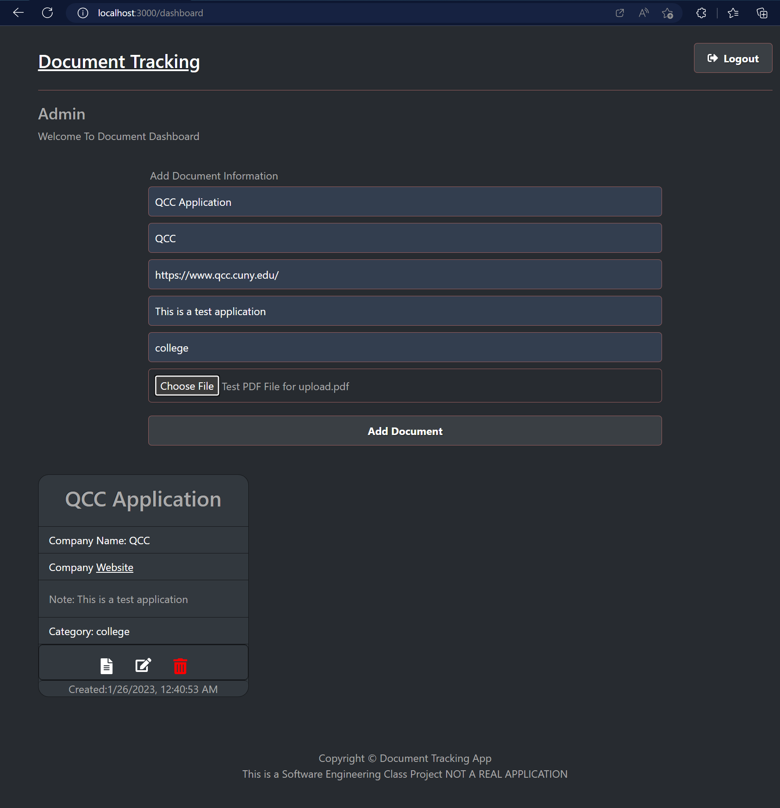

# Project Title

# MERN Document Tracking Project

This App will allow you to keep track of your document(s); whenever you need, you can look for documents saved, get a copy of it, and add a note about the saved file. This web-based App is compatible with all updated browsers on PCs and mobile devices.
Who can use this App: This is a practice project with basic features at the current stages; the next version will have new features to make it better with minimum functionality for a document tracking App and easy access and use for everyone interested.
What is the intention of building this App? This final project of the software engineering boot camp.

## Demo link:

- Not available

### The app is deployed on Render free plan; with the free plan, if the app is not used for 15 minutes. The server goes into sleep mode. If the app is not loading quickly, you must wait at least 30 seconds or more. Read more: https://render.com/docs/free

## Link to Backend

- https://github.com/MOHAMMADI-AF/FPBE.git

## Table of Content:

- About The App
- Technologies
- Setup
- Status

## About The App

MERN Full Stack App: FRONTEND (see the above like for BACKEND)

## Technologies

MongoDB, Express, React & NodeJS and dependencies

## Setup

### download or clone the repository

- cd frontend

- npm install

- cd backend

- npm install

### create the .env and add your MONGODB_URI

- cd frontend

- npm start

- cd backend

- nodemon

or edit the package.json files to configure the scripts and run the FrontEnd and Backend together in React.js and Express.js with 'concurrently' package
